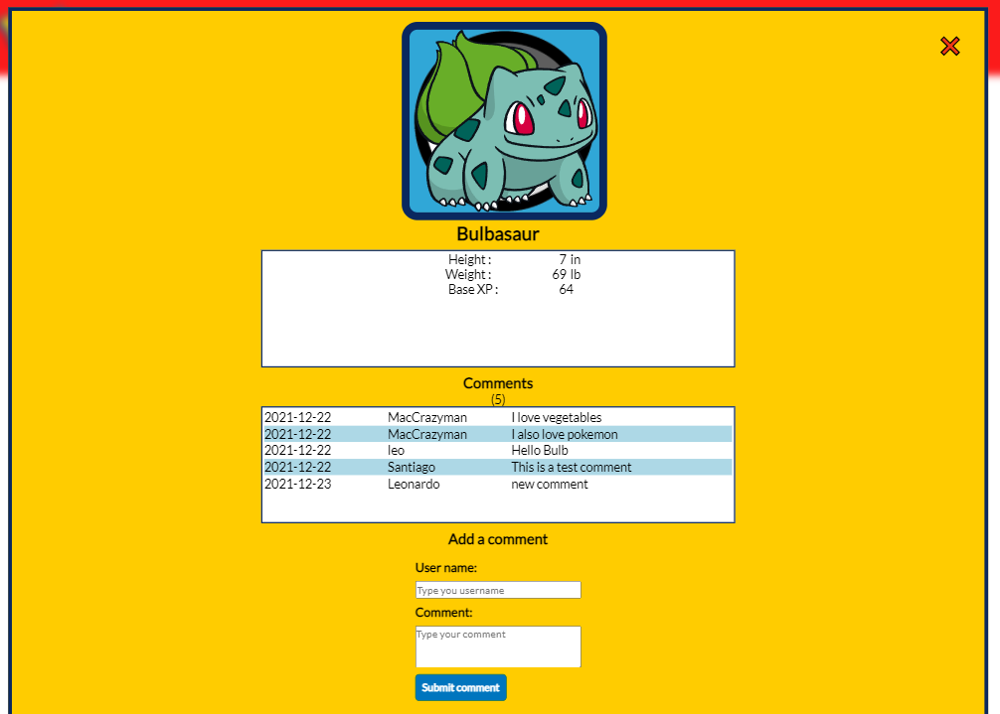

# POKEDEX CAPSTONE

> Web page used to retrieve information about Pokemons using Pokeapi v2





This project implements the involvement API and the Pokeapi to display data about several Pokemons and let the user interact leaving likes and comments to their favourite Pokemons.

## Built With

- HTMl, CSS, JavaScript
- Webpack
- [Involvement API](https://www.notion.so/Involvement-API-869e60b5ad104603aa6db59e08150270)
- [PokeAPI](https://pokeapi.co/)

## Live Demo

[Live Demo Link](https://maccrazyman.github.io/pokemon-capstone/)


## Getting Started

To get a local copy follow these simple example steps.

### Prerequisites
* A functional computer with VS Code or any functional coding software.
* Git bash or any version control software.

### Setup
* Copy the repo link and clone it in your local machine
* You can execute the following command in your git bash:
    ```` 
    git clone https://github.com/MacCrazyman/pokemon-capstone.git
    ````

### Install
* In your consle, run the following command to install the required dependencies:
    ````
    npm install
    ````


### Usage
* You can build the files using webpack to generate a `/dist` folder with distribution files:
    ````
    npm run build
    ````
* Run webpack server to see the webpage working:
    ````
    npm run start
    ````
* You can also open the [GitHub pages deployment](https://maccrazyman.github.io/pokemon-capstone/) to see a live version of the webpage.


## Authors

👤 **Santiago Velosa**

- GitHub: [@vechicin](https://github.com/vechicin)
- Twitter: [@therealvelosa](https://twitter.com/therealvelosa)
- LinkedIn: [Santiago Velosa Arias](https://www.linkedin.com/in/santiago-velosa-arias-5b7543112/)

👤 **Leonardo Pareja**

- GitHub: [@MacCrazyman](https://github.com/MacCrazyman)
- Twitter: [@MacCrazyman](https://twitter.com/MacCrazyman)
- LinkedIn: [Leonardo Pareja](https://www.linkedin.com/in/leonardo-pareja-pareja/)


## 🤝 Contributing

Contributions, issues, and feature requests are welcome!

Feel free to check the [issues page](../../issues/).

## Show your support

Give a ⭐️ if you like this project!


## 📝 License

This project is [MIT](./LICENSE) licensed.
